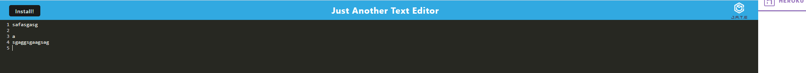

# TextEditor

## Table of Contents

- [Description](#Description)
- [Installation](#Installation)
- [Tests](#Tests)
- [Contributing](#Contributing)
- [License](#License)
- [Questions](#Questions)

## Description

This is a simple text editor application that uses both client and server side logic to store user inputs. This uses the integrated database in the browser to store any text and a service worker is enabled so that the text remains even when the page is closed. The application is hosted on heroku and was optimised using webpack config.

## Installation

The application is hosted on Heroku, you can go to the link here:
There is also an install button on the site for offline use. If you install it to your browser the text editor application will be available offline and easily accesible without having to remember the link.

## Tests

You can test the functionality using the Chrome Browser dev tools or running Jest npm tests.

## Screenshot

## Contributing

Adrian Szonyi

## License

The MIT License (MIT) Copyright (c) 2015 Chris Kibble Permission is hereby granted, free of charge, to any person obtaining a copy of this software and associated documentation files (the Software), to deal in the Software without restriction, including without limitation the rights to use, copy, modify, merge, publish, distribute, sublicense, and/or sell copies of the Software, and to permit persons to whom the Software is furnished to do so, subject to the following conditions The above copyright notice and this permission notice shall be included in all copies or substantial portions of the Software. THE SOFTWARE IS PROVIDED AS IS, WITHOUT WARRANTY OF ANY KIND, EXPRESS OR IMPLIED, INCLUDING BUT NOT LIMITED TO THE WARRANTIES OF MERCHANTABILITY, FITNESS FOR A PARTICULAR PURPOSE AND NONINFRINGEMENT. IN NO EVENT SHALL THE AUTHORS OR COPYRIGHT HOLDERS BE LIABLE FOR ANY CLAIM, DAMAGES OR OTHER LIABILITY, WHETHER IN AN ACTION OF CONTRACT, TORT OR OTHERWISE, ARISING FROM, OUT OF OR IN CONNECTION WITH THE SOFTWARE OR THE USE OR OTHER DEALINGS IN THE SOFTWARE.

## Questions

My Github Profile link: [_here_](https://github.com/Adrian-szonyi)
if you have any additional questions you can reach me using the details below:

Email: aszonyi49@gmail.com